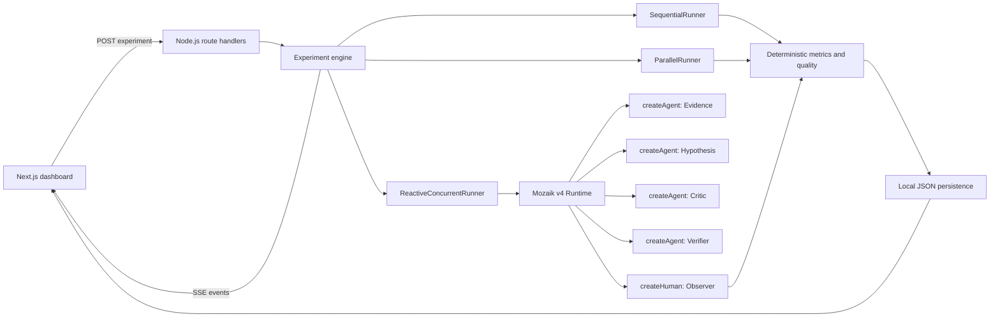

# ConcurProof

ConcurProof is a concurrency auditor and experimental harness for multi-agent AI systems. It runs one controlled production-incident benchmark under sequential, naive-parallel, and reactive-concurrent policies, records safe runtime evidence, and measures whether live cross-agent interaction changed the result.

## Problem

Starting several agents at the same time does not prove that they collaborate. A system can look concurrent while its agents are isolated, and a faster run can still produce a worse answer. ConcurProof separates overlap from interaction by recording explicit reaction edges and then comparing latency and objective answer quality on the same task.

## Solution

One click executes the same four roles in three modes:

| Mode | Policy | Mid-run reactions |
| --- | --- | --- |
| Sequential | Evidence, then Hypothesis, then Critic, then Verifier | No |
| Naive Parallel | All four start together with isolated context | No |
| Reactive Concurrent | All four join one Mozaik v4 runtime and selectively react through situation handlers | Yes |

The dashboard streams each run through server-sent events, renders real activity intervals, links triggering and responding events, persists completed results as JSON, and supports one reaction-edge ablation.

## Why Mozaik?

Reactive Concurrent mode uses `@mozaik-ai/core` v4 directly. Every experiment creates an isolated runtime with `defineRuntime`, a typed `RuntimeState`, four agents from `createAgent`, and a passive observer from `createHuman`. A semantic run-start event activates all four agents; situation handlers then publish and react to structured `SemanticEvent` payloads while other work is still active. Provider-backed runs use the native streaming `runLoop`, and the observer records safe lifecycle metadata, public structured outputs, and v4 loop IDs without persisting streaming content or private chain-of-thought.

The fixture path changes model output generation only. Reactive fixture runs still use the real Mozaik v4 runtime, participant factories, semantic events, and situation processors, and every fixture result is visibly labelled `Demo / Fixture mode`.

Mozaik Cloud is optional. When `MOZAIK_API_KEY` is present, provider-backed v4 loop events are exported by the runtime. The example environment sets `MOZAIK_REDACTION=content` so prompts, answers, and tool output are redacted by default.

## Demo

The included **Production Incident #001** benchmark contains 16 structured evidence items about a fictional checkout outage. It includes deployment timing, heap and garbage-collection behavior, database and dependency noise, canary evidence, a code-level cache clue, and contradictory hypotheses. The known answer is an unbounded image-metadata cache introduced in `checkout-api` v2.4.1.

The intended 2 to 3 minute flow is:

1. Open the dashboard and click **Run full experiment**.
2. Watch Sequential, Naive Parallel, and Reactive Concurrent execute in order.
3. Inspect overlap and explicit reaction traces in the swim-lane timeline.
4. Compare measured latency and deterministic answer quality.
5. Select the Evidence to Hypothesis edge and run the ablation.
6. Review the measured contribution and save the result certificate as PNG.

Saved runs are available at `/runs/[id]`; saved three-mode comparisons are available at `/compare/[experimentId]`.

## Architecture



Key implementation areas:

- `src/lib/benchmarks`: controlled evidence and known-answer definition
- `src/lib/agents`: shared prompts, fixture outputs, one-shot inference, and four reactive participants
- `src/lib/mozaik`: v4 runtime state, semantic event contracts, and passive situation-handler observer
- `src/lib/runners`: the three execution policies and common run finalization
- `src/lib/metrics`: overlap, reaction, quality, lift, and concurrency score calculations
- `src/lib/experiments`: run orchestration, SSE session state, and ablation
- `src/lib/persistence`: atomic local JSON writes

## Metrics

Every displayed value is calculated from persisted run records.

### Total latency

`finishedAt - startedAt`

### Agent active intervals

Each inference or reaction activity records its agent, start, finish, and reason. These intervals drive the swim lanes and overlap calculation.

### Active overlap

The interval sweep measures:

- `activeWindowMs`: time with at least one agent active
- `overlapMs`: time with at least two agents active
- `activeOverlapPercent = overlapMs / activeWindowMs * 100`

Launching agents together is therefore insufficient by itself.

### Cross-agent reactions

A reaction is counted only when a responding agent explicitly carries the triggering event ID. Each edge stores the source event, source agent, reacting agent, response event, reaction timestamp, and reaction latency.

### Median reaction latency

The median of `reaction start timestamp - triggering event timestamp` across explicit reaction edges. Runs without reactions report `n/a`.

### Quality score

The benchmark score is deterministic and capped to 0 through 100:

```text
55 points  correct root cause
35 points  required-evidence recall
10 points  evidence precision
-4 points  per incorrect evidence ID
-5 points  per unsupported claim ID
```

No evaluator LLM assigns this score.

### Concurrency Score

The score is the sum of six capped components:

| Component | Weight | Formula |
| --- | ---: | --- |
| Active overlap | 25 | `clamp(overlapPercent / 100) * 25` |
| Explicit reactions | 20 | `clamp(reactionCount / 6) * 20` |
| Reaction speed | 15 | `clamp(1 - medianReactionLatencyMs / 2000) * 15` |
| Latency lift | 15 | `clamp((sequentialLatency - latency) / sequentialLatency) * 15` |
| Quality preservation | 15 | `clamp(quality / sequentialQuality) * 15` |
| Ablation dependency | 10 | `clamp((normalQuality - ablationQuality) / 20) * 10` |

`clamp` constrains a component input to 0 through 1. Ablation dependency is zero until an ablation has run. The complete breakdown is exposed under **How this score is calculated** in the report.

### Concurrency Lift

For both Sequential and Naive Parallel baselines:

- `latency delta % = (reactiveLatency - baselineLatency) / baselineLatency * 100`
- `quality difference = reactiveQuality - baselineQuality`

A negative latency delta means Reactive Concurrent was faster. The interface reports measured values even when they are unfavorable.

## Ablation

The interaction graph groups recorded reactions by source and target agent. Running an ablation suppresses the selected reaction class, such as Evidence to Hypothesis, then reruns Reactive Concurrent mode on the same benchmark and model setting.

`measured contribution = normal reactive quality - ablated reactive quality`

This is an experimental result for one benchmark execution. It is not a claim of philosophical causality or statistical significance.

## Running locally

Requirements: Node.js 20.9 or newer and npm.

```bash
npm install
cp .env.example .env.local
npm run proof:mozaik
npm test
npm run dev
```

Open [http://localhost:3000](http://localhost:3000). If port 3000 is occupied, Next.js prints the alternate local URL.

Useful commands:

```bash
npm run proof:mozaik       # factories, runtime membership, semantic reaction, and observer proof
npm run benchmark:fixture  # deterministic three-mode CLI run plus ablation
npm test                   # metric unit tests
npm run lint
npm run build
```

PowerShell users can create the environment file with:

```powershell
Copy-Item .env.example .env.local
```

## Environment variables

All credentials are read only on the server.

| Variable | Purpose |
| --- | --- |
| `MOZAIK_MODEL` | Mozaik model name. Defaults to `gpt-5.4-mini`. |
| `OPENAI_API_KEY` | Credential for an OpenAI model. |
| `ANTHROPIC_API_KEY` | Credential when `MOZAIK_MODEL` starts with `claude-`. |
| `GEMINI_API_KEY` | Credential when `MOZAIK_MODEL` starts with `gemini-`. |
| `MOZAIK_API_KEY` | Optional Mozaik Cloud project key for native v4 loop telemetry. |
| `MOZAIK_PROJECT_ID` | Optional Mozaik Cloud project handle. |
| `MOZAIK_REDACTION` | Cloud payload privacy level; the example defaults to `content`. |

Only the credential for the selected provider is required. With no matching provider key, ConcurProof deliberately enters labelled fixture mode. If a configured real provider or model fails, the run is marked failed and the error is shown; fixture data is not substituted.

## Persistence

Runs are written atomically to `data/runs/<run-id>.json`; comparisons are written to `data/experiments/<experiment-id>.json`. Generated JSON is ignored by Git. The persistence layer is intentionally local for the hackathon MVP.

## Limitations

- The project contains one controlled incident benchmark, not a general agent evaluation platform.
- One run is not statistically significant. Model-backed results may vary between executions.
- Fixture timing and structured outputs are deterministic demonstrations, not provider-performance measurements.
- SSE session state is in memory and local JSON is single-machine storage. This is not designed for multi-instance deployment.
- The current ablation suppresses one source-agent to reacting-agent class, not an arbitrary causal subgraph.
- Quality measures agreement with this benchmark's known answer and evidence set; it does not measure every dimension of investigation quality.
- The certificate is a ConcurProof benchmark result, not cryptographic proof or independent accreditation.

## Verification status

The repository includes a Mozaik v4 runtime proof, deterministic metric tests, a fixture benchmark script, production build checks, and the complete browser flow for the dashboard, persisted run view, comparison view, and ablation.
